<div align="center">

<a href="https://hattah-store.vercel.app">
  
</a>

<br>

[](https://nextjs.org)
[](https://react.dev)
[](https://www.typescriptlang.org)
[](https://tailwindcss.com)
[](https://supabase.com)
[](https://hattah-store.vercel.app)
[](https://hattah-store.vercel.app)

### [🛍️ **Live Demo → hattah-store.vercel.app**](https://hattah-store.vercel.app)

**العربية** · **English** · **Türkçe**  — light & dark — order straight to WhatsApp

</div>

---

## 🫒 The story

**HATTAH (حَطّة)** is a real, running business: an Istanbul-based brand that sells authentic Palestinian and Gazan heritage products — embroidery, keffiyehs, jewelry, home décor and food.

Its customers already talk on WhatsApp, so the store doesn't pretend to be Amazon. It is a fast, beautiful catalogue in **three languages** (Arabic first, right-to-left by default) where "buy" means *a ready-written WhatsApp message to the owner*, and a private admin panel lets the owner run the whole shop from a phone.

I designed, built, deployed and operate it end to end. This repository is the exact code behind the live site.

---

## 📸 Screenshots

> Taken from the live site with Playwright. Product data is the real catalogue.

<p align="center">
  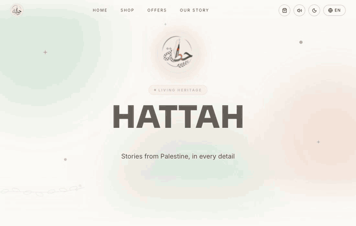<br>
  <sub>Language switch (AR → TR → EN), light/dark toggle, opening a product</sub>
</p>

### Storefront

<p align="center">
  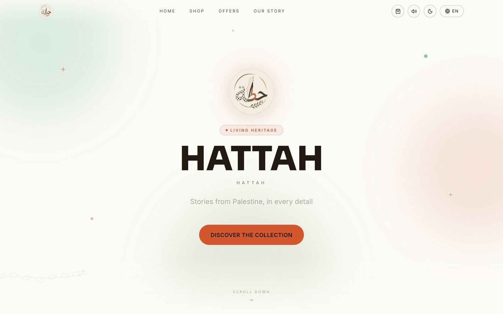
</p>
<p align="center">
  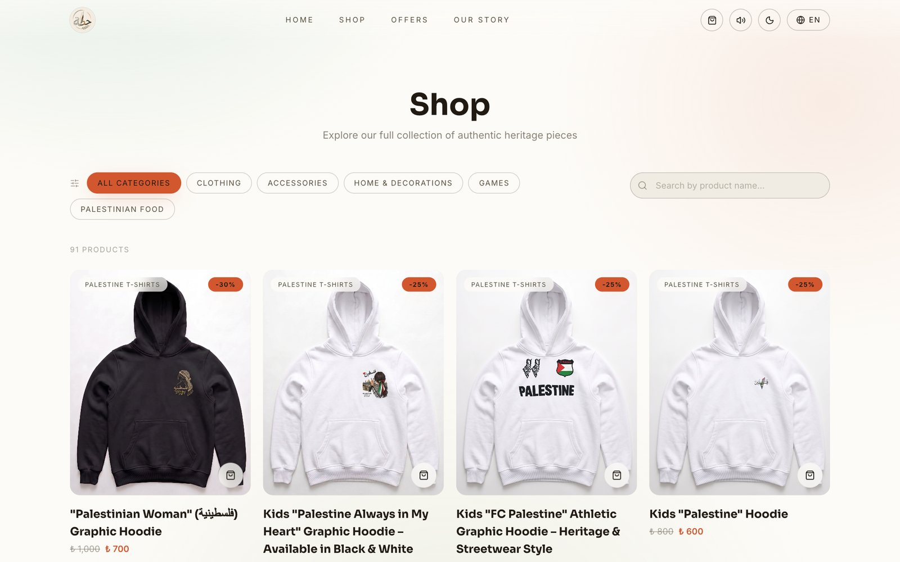
</p>

### Product page — desktop & mobile

<p align="center">
  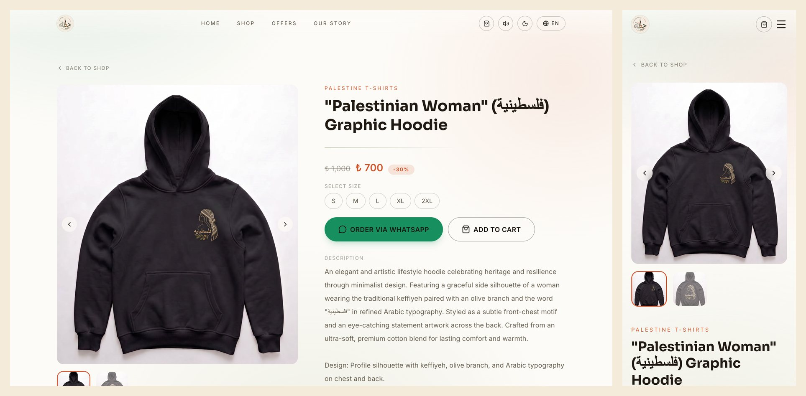
</p>

### Three languages (Arabic is right-to-left)

<p align="center">
  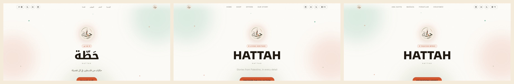<br>
  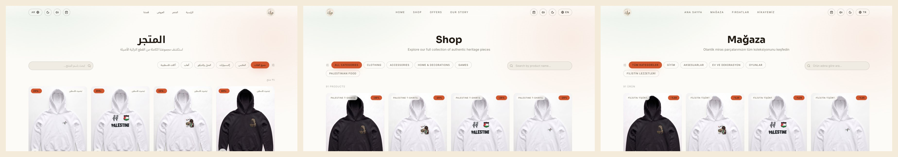<br>
  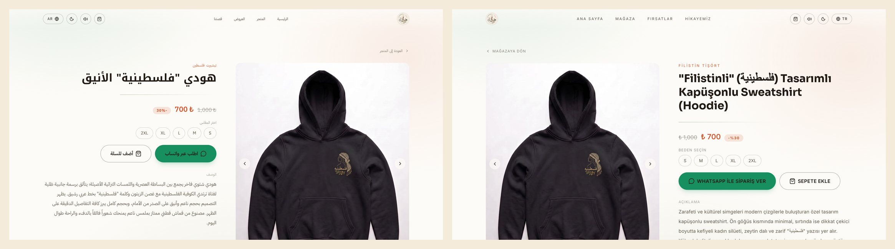
</p>

### Light vs dark

<p align="center">
  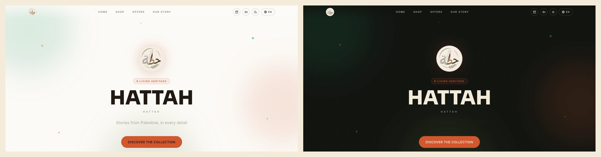<br>
  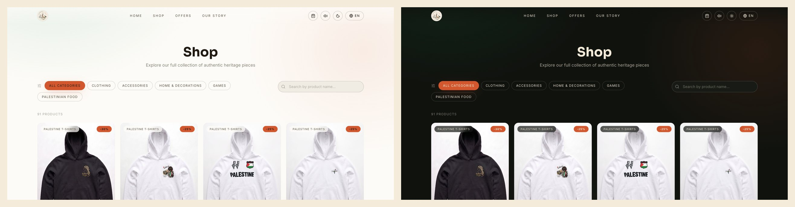
</p>

### Admin panel

> Captured on a **local** Supabase seeded with `npm run seed` (fake products, fake prices, generated artwork) — no production data is shown.

<table>
  <tr>
    <td width="50%">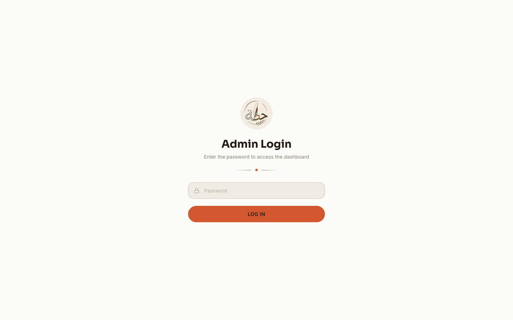<br><sub>Password login</sub></td>
    <td width="50%">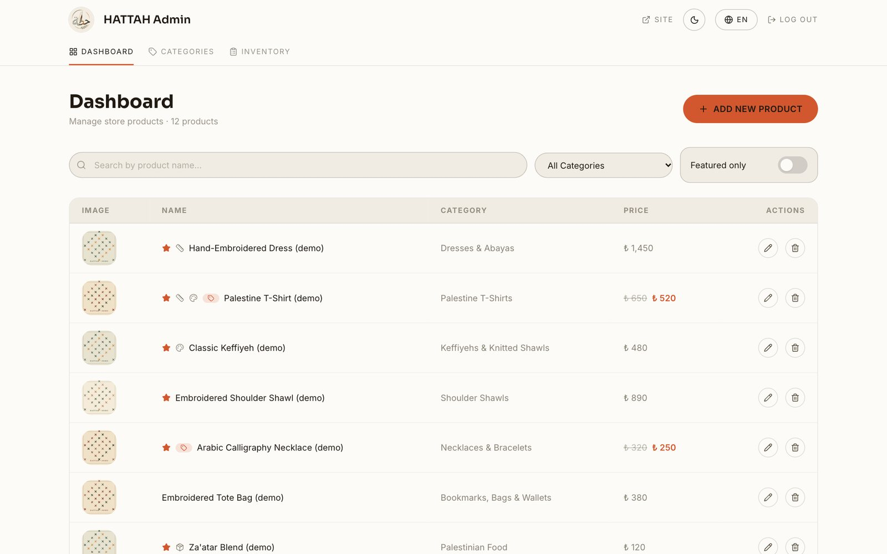<br><sub>Dashboard: search, category filter, featured toggle</sub></td>
  </tr>
  <tr>
    <td>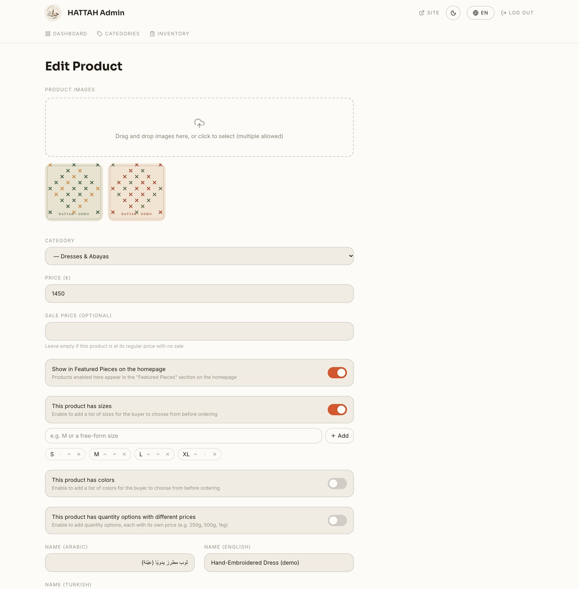<br><sub>Product form: multi-image upload, sale price, variants</sub></td>
    <td>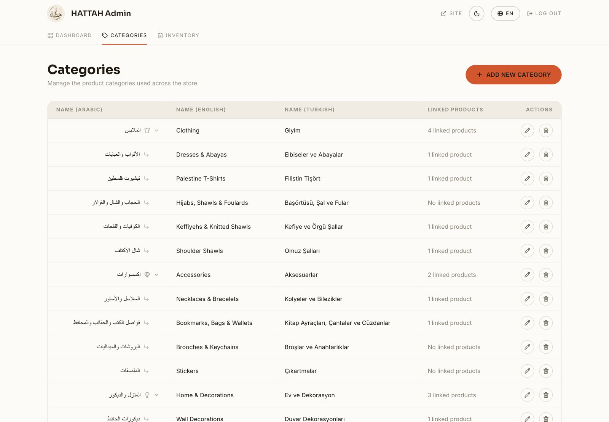<br><sub>Dynamic two-level categories</sub></td>
  </tr>
  <tr>
    <td colspan="2" align="center">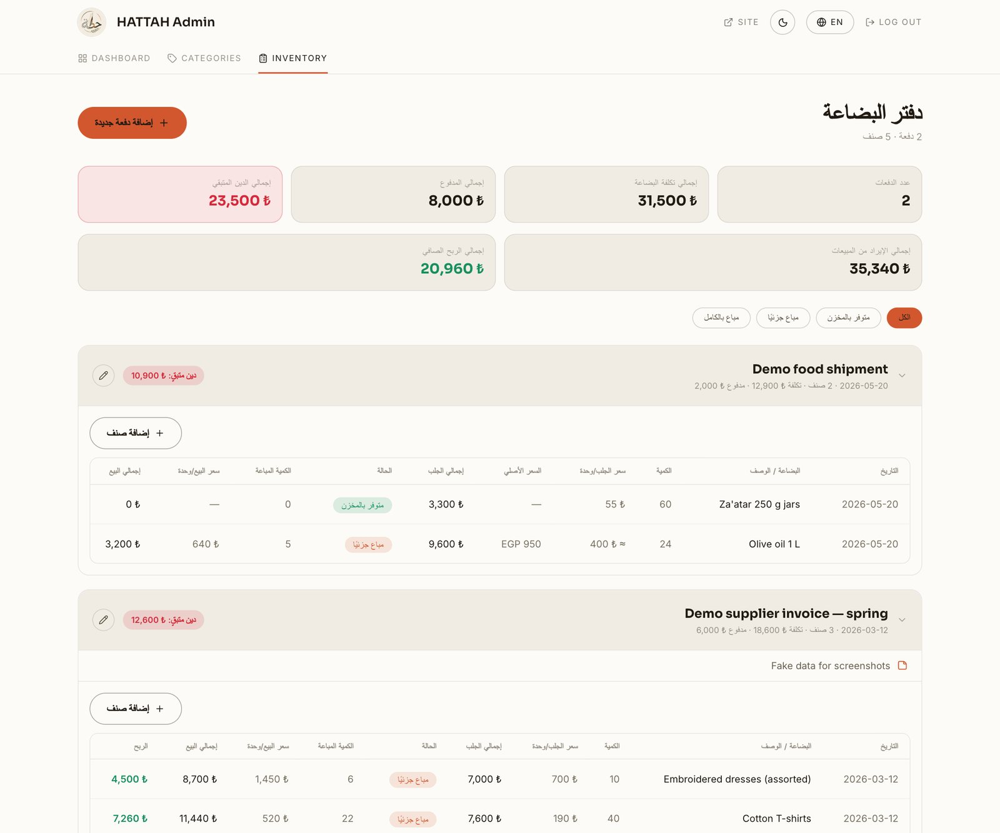<br><sub>Inventory ledger (Arabic-only UI): purchase batches, line items, debt and profit totals</sub></td>
  </tr>
</table>

---

## ✨ Features

### 🛍️ Storefront
- Home page with hero, auto-generated category tiles, featured pieces and the brand story
- Shop with two-level category filtering and live search
- Product pages: image gallery, description, variant pickers, **Order via WhatsApp** or **Add to cart**
- Cart drawer (persisted in the browser) that checks out as one pre-written WhatsApp message
- Sale prices with struck-through original and discount badge, plus a dedicated **Offers** page that only appears when something is on sale
- Product variants: **sizes**, **colors** (translated per language) and **priced quantity options** (e.g. 250 g / 500 g / 1 kg)

### 🔐 Admin panel
- Product CRUD with **multi-image upload** (images are compressed in the browser before upload)
- **Dynamic categories** — create, edit and delete (deletion is refused while products or subcategories are still linked), with per-language tile copy and icon
- Variants editors for sizes, colors and quantity options; optional sale price; "featured on homepage" switch
- **Inventory ledger**: purchase batches with line items, amount paid, remaining debt, optional original-currency reference price, sold quantities and profit
- Everything behind a server-checked session (see [Security](#-security))

### 🌍 Internationalisation
- **Arabic (default, RTL)**, **English**, **Turkish** via `next-intl`, with locale-prefixed URLs
- Every product, category and color carries its own `_ar` / `_en` / `_tr` fields
- Separate display fonts per script (Noto Kufi Arabic / IBM Plex Sans Arabic for Arabic; Sora / Inter for Latin)

### 🎨 UX
- **Light / dark theme**, persisted, applied before first paint to avoid a flash
- **Web Audio sound system** — UI click sounds synthesised in the browser (no audio files), with a mute toggle that is remembered
- Motion with Framer Motion, tatreez-inspired ornaments, ambient backgrounds and loading screen
- Mobile-first layouts

---

## 🏗️ Architecture

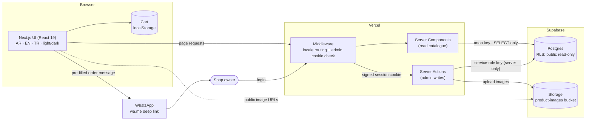

### Ordering flow

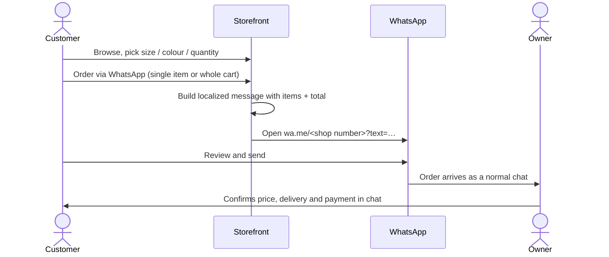

### Data model

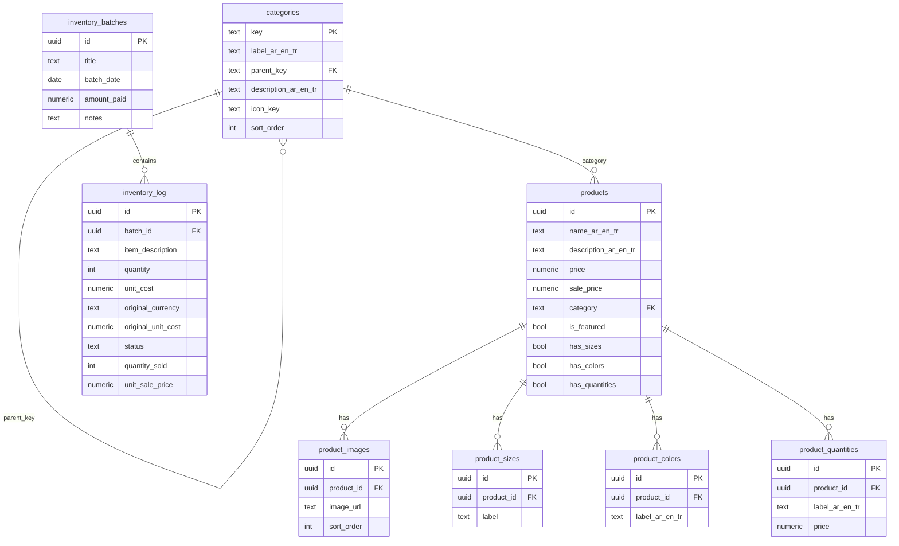

`inventory_*` tables are deliberately independent of `products` — a batch of stock doesn't always map one-to-one to a listing — and are never read by the storefront.

---

## 🔒 Security

This is a live store, so the defaults are conservative:

| Layer | What protects it |
|---|---|
| **Database (RLS)** | Row Level Security is enabled on **every** table. The anonymous role gets `SELECT` policies on the catalogue tables only. There are **no** insert/update/delete policies, and the `inventory_*` tables have **no policies at all**, so the public key cannot write anything or read the ledger. |
| **Writes** | All writes happen in Next.js Server Actions using the Supabase **service-role key**, which lives only in server environment variables. The client is guarded with `import "server-only"` so it can't be bundled into browser code. |
| **Admin routes** | Checked in **two places**: middleware redirects any `/admin/*` request without a valid session cookie, and the protected layout re-checks on the server. |
| **Server Actions** | Every exported admin action calls `assertAdminSession()` first, so calling an action directly (without visiting the UI) is still rejected. |
| **Session** | HMAC-SHA256 signed cookie: `httpOnly`, `sameSite=lax`, `secure` in production, 2-hour **sliding** expiry. Password and token comparisons are constant-time. |
| **Storage** | The `product-images` bucket is public-read; there are no storage write policies for the anon role. |
| **Secrets** | `.env*` is git-ignored (only `.env.example` with placeholders is tracked). The git history was scanned: no service-role key, admin password or session secret was ever committed. Only the public URL and anon key reach the browser. |

Known trade-offs, stated honestly: admin access is a single shared password (not per-user accounts), and login attempts are not rate-limited at the application layer. Rotating `ADMIN_SESSION_SECRET` signs everyone out immediately.

---

## ⚡ Performance

Lighthouse run against the live home page (`/en`) on **2026-10-04**, Chrome headless, 3 runs per form factor — **median** shown (full spread in brackets).

| Form factor | Performance | Accessibility | Best Practices | SEO |
|---|:-:|:-:|:-:|:-:|
| 📱 Mobile (simulated slow 4G) | **69** (66–72) | **94** | **100** (96–100) | **100** |
| 🖥️ Desktop | **91** | **94** | **96** (96–100) | **100** |

Mobile performance is the number I'd like to improve next. Product images are served as-is from Supabase Storage (`images.unoptimized`) because Vercel's free-plan optimizer quota is limited.

---

## 🧠 Tech decisions

| Decision | Why |
|---|---|
| **Next.js App Router + Server Components** | The catalogue renders on the server (good SEO, small client bundle); only interactive pieces are client components. |
| **Supabase (Postgres + Storage)** | A real relational model with RLS, plus image hosting, on a free tier that fits a small shop. |
| **Service-role writes through Server Actions, no public write policies** | The browser never holds a key that can write. The smallest possible attack surface for a live store. |
| **Signed-cookie admin session instead of user accounts** | One owner, one password — simple, no extra auth service, and still verified on the server for every action. |
| **WhatsApp checkout instead of a payment gateway** | It matches how the shop's customers already buy; it ships today with no PCI scope. Payments are on the roadmap. |
| **`next-intl` with locale-prefixed routes** | Real URLs per language, per-language metadata, and proper RTL for Arabic. |
| **Translated columns (`_ar/_en/_tr`) instead of a translations table** | Three fixed languages; simpler queries and a simpler admin form. |
| **Browser-side image compression** | Phone photos exceed server-action size limits; compressing first makes uploads fast and reliable. |
| **Web Audio synthesis** | UI sounds without shipping audio files. |
| **Tailwind CSS v4 + CSS variables for theming** | Light/dark and per-locale fonts are just variable swaps. |

---

## 🗂️ Project structure

```
hattah-store/
├── messages/                 # ar.json · en.json · tr.json (UI copy)
├── public/images/            # logo
├── scripts/seed.mjs          # demo-data seeder (local Supabase only by default)
├── supabase/
│   ├── schema.sql            # full schema + RLS + storage bucket (fresh install)
│   └── migrations/           # incremental SQL for existing projects (001 … 011)
└── src/
    ├── middleware.ts         # locale routing + admin session gate
    ├── i18n/                 # routing, request config, navigation helpers
    ├── actions/              # Server Actions: products, categories, inventory, auth
    ├── app/[locale]/
    │   ├── (site)/           # home · shop · offers · product/[id]
    │   └── admin/            # login + protected dashboard, products, categories, inventory
    ├── components/           # admin · cart · home · layout · product · shop · ui
    ├── contexts/CartContext.tsx
    └── lib/                  # supabase clients, whatsapp links, sound, admin-auth, types
```

---

## 🚀 Local setup

**Requirements:** Node 20+ and a Supabase project (cloud, or local via Docker).

```bash
git clone https://github.com/SaadOsama10/hattah-store.git
cd hattah-store
npm install
cp .env.example .env.local        # then fill in the values below
```

### 1. Create the database

In your Supabase project → **SQL Editor**, run [`supabase/schema.sql`](supabase/schema.sql). It creates all tables, the default category tree, RLS policies and the public `product-images` bucket.
(Already have an older database? Apply the numbered files in [`supabase/migrations/`](supabase/migrations) in order.)

### 2. Environment variables

| Variable | Purpose |
|---|---|
| `NEXT_PUBLIC_SUPABASE_URL` / `NEXT_PUBLIC_SUPABASE_ANON_KEY` | Public, read-only (protected by RLS) |
| `SUPABASE_SERVICE_ROLE_KEY` | **Secret.** Server only — used by admin Server Actions |
| `NEXT_PUBLIC_WHATSAPP_NUMBER` | Orders go here (international format, no `+`) |
| `NEXT_PUBLIC_INSTAGRAM_URL` / `NEXT_PUBLIC_FACEBOOK_URL` | Footer links (optional) |
| `ADMIN_PASSWORD` | Admin login password |
| `ADMIN_SESSION_SECRET` | Signs the session cookie — `openssl rand -hex 32` |

### 3. (Optional) Load demo data

```bash
npm run seed            # 12 fake products, generated artwork, a small inventory ledger
npm run seed -- --reset # wipe products + inventory first
```

The seeder **refuses to run against a non-local Supabase** unless `ALLOW_REMOTE_SEED=1` is set, because `--reset` deletes every product. Use it on a local stack or a throwaway project only.

<details>
<summary>Run Supabase locally with Docker</summary>

```bash
npx supabase init && npx supabase start
# apply the schema to the local database
docker exec -i supabase_db_<project> psql -U postgres < supabase/schema.sql
```

`supabase start` prints the local API URL and keys — put them in `.env.local`, then `npm run seed`. (Use `schema.sql`, not `migrations/`, for a fresh database; the migrations are upgrade scripts.)
</details>

### 4. Run

```bash
npm run dev      # http://localhost:3000  →  /ar by default
npm run build    # production build
npm run lint
npm run typecheck
```

Admin lives at `/{locale}/admin` (e.g. `/en/admin`).

### Deploy

Import the repo in Vercel, add the same environment variables, deploy. (This is how the live site runs.)

---

## 🗺️ Roadmap

- [ ] Custom domain
- [ ] Online payments
- [ ] Mobile app

---

## 👤 Author

**Saed O S Radi** — 4th-year Software Engineering student at FSMVU.
[GitHub @SaadOsama10](https://github.com/SaadOsama10)

<div align="center">
<sub>Built with care for Palestinian heritage. 🇵🇸</sub>
</div>
